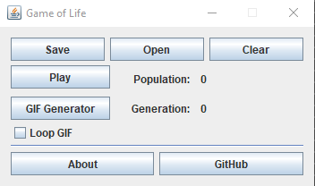

# Java Game Of Life
El juego de la vida es un autómata celular diseñado por el matemático británico John Horton Conway en 1970. Se trata de un juego de cero jugadores, lo que quiere decir que su evolución está determinada por el estado inicial y no necesita ninguna entrada de datos posterior.
## Contenido
* [Reglas](#reglas)
* [GUI](#gui)
    * [Controles](#controles)
        * [Guardando y cargando patrones](#guardando-y-cargando-patrones)
    * [Rejilla](#rejilla)
    * [Generando animaciones](#generando-animaciones)
* [Ejemplos](#ejemplos)
## Reglas
El "tablero de juego" es una malla plana y toroidal formada por cuadrados (las "células") que se extiende por el infinito en todas las direcciones. Por tanto, cada célula tiene 8 "vecinas", que son las que están próximas a ella, incluidas las diagonales. Las células tienen dos estados: están "vivas" o "muertas" (o "encendidas" y "apagadas"). El estado de las células evoluciona a lo largo de unidades de tiempo discretas (se podría decir que por turnos). El estado de todas las células se tiene en cuenta para calcular el estado de las mismas al turno siguiente. Todas las células se actualizan simultáneamente en cada turno, siguiendo estas reglas:

1. **Una célula muerta con exactamente 3 células vecinas vivas "nace" (es decir, al turno siguiente estará viva).**
2. **Una célula viva con 2 o 3 células vecinas vivas sigue viva, en otro caso muere (por "soledad" o "superpoblación").**

Extraído de [Wikipedia](https://es.wikipedia.org/wiki/Juego_de_la_vida)
## GUI
### Controles
La ventana de controles permitirá arrancar el cómputo de estados del juego. Con el botón Play (podrás parar el juego con Stop). Además, observaremos la población de cada estado y su respectiva generación.

#### Guardando y cargando patrones
Una parte a resaltar de la GUI es que podremos guardar y cargar patrones. Para guardar patrones simplemente dibujaremos uno previamente en la rejilla haciendo clic en los lugares deseados. Y luego, en la ventana de controles el botón "Save" creará un archivo formato **jglf** con una lista de coordenadas en las que las células están vivas.

Una vez tengamos nuestros propios patrones, podremos cargarlos con el botón "Open". Luego, automáticamente limpiará la rejilla y cargará toda la población.

### Rejilla
En la rejilla visualizaremos el cambio de estados y (cuando el juego esté en pausa) podremos dibujar patrones personalizados. El juego está programado de forma toroidal (Similar a la superficie de un planeta representada en un plano). Por tanto **la rejilla NO es infinita**.

### Generando animaciones
Puedes generar animaciones a través del botón especificado en la GUI. Luego deberás proporcionar una ruta de salida para las imágenes generadas y los colores a utilizar. Además, es posible tomar cualquier archivo y convertirlo a un patrón de inicio para el juego basado en los bytes del archivo. Esto con la finalidad de generar diversos patrones sin "dibujarlos" en la rejilla. Algo de utilidad para pruebas rápidas.

## Ejemplos
Puedes descargar algunos patrones como [ejemplos](https://github.com/crixodia/java-game-of-life/blob/master/examples/). Uno de los más intrigantes son los osciladores ([osc.jglf](https://github.com/crixodia/java-game-of-life/blob/master/examples/osc.jglf)).

Al generar una animación gif obtendrás algo similar a la siguiente imagen. Podrás definir la posibilidad de un gif en ciclo infinito.

🧐 Para sugerencias o preguntas puedes contactar a [@crixodia](https://www.twitter.com/crixodia)