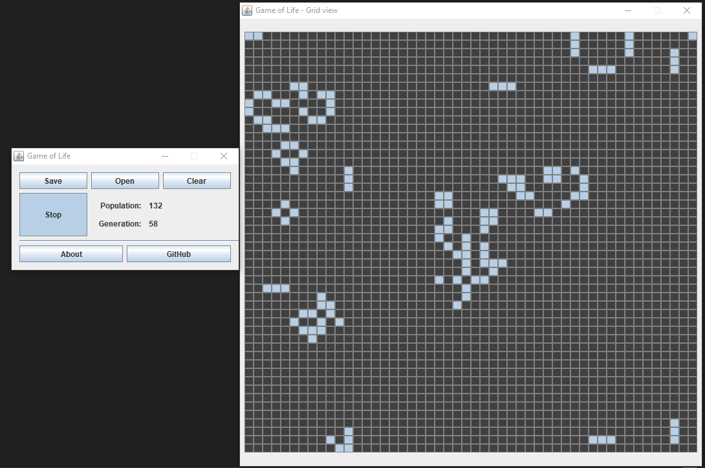

# Java Game Of Life
El juego de la vida es un autómata celular diseñado por el matemático británico John Horton Conway en 1970. Se trata de un juego de cero jugadores, lo que quiere decir que su evolución está determinada por el estado inicial y no necesita ninguna entrada de datos posterior.
## Contenido
* [Reglas](#reglas)
* [GUI](#gui)
    * [Controles](#controles)
        * [Guardando y cargando patrones](#guardando-y-cargando-patrones)
    * [Rejilla](#rejilla)
* [Ejemplos](#ejemplos)
## Reglas
El "tablero de juego" es una malla plana formada por cuadrados (las "células") que se extiende por el infinito en todas las direcciones. Por tanto, cada célula tiene 8 células "vecinas", que son las que están próximas a ella, incluidas las diagonales. Las células tienen dos estados: están "vivas" o "muertas" (o "encendidas" y "apagadas"). El estado de las células evoluciona a lo largo de unidades de tiempo discretas (se podría decir que por turnos). El estado de todas las células se tiene en cuenta para calcular el estado de las mismas al turno siguiente. Todas las células se actualizan simultáneamente en cada turno, siguiendo estas reglas:

1. **Una célula muerta con exactamente 3 células vecinas vivas "nace" (es decir, al turno siguiente estará viva).**
2. **Una célula viva con 2 o 3 células vecinas vivas sigue viva, en otro caso muere (por "soledad" o "superpoblación").**

Extraído de [Wikipedia](https://es.wikipedia.org/wiki/Juego_de_la_vida)
## GUI
Ejecutando el juego notaremos dos ventanas, una con los controles y otra con la rejilla correspondiente al cambio de estados.

### Controles
La ventana de controles permitirá arrancar el cómputo de estados del juego con el botón Play (podrás parar el juego con Stop). Además observaremos la población de cada estado y la generación.

#### Guardando y cargando patrones
Una parte importante de la GUI es que podremos guardar y cargar patrones. Para guardar patrones simplemente dibujaremos uno previamente en la rejilla haciendo clic en los lugares deseados. Y luego, en la ventana de controles el botón "Save" creará un archivo formato **jglf**. Esto con el fin de evitar errores al cargar un archivo.

Una vez tengamos nuestros propios patrones, podremos cargarlos con el botón "Open" que automáticamente limpiara la rejilla y cargará toda la población.

### Rejilla
En la rejilla visualizaremos el cambio de estados y (cuando el juego esté en pausa) podremos dibujar patrones personalizados. El juego está programado de forma toroidal (Similar a la superficie de un planeta representada en un plano). Por tanto **la rejilla NO es infinita**.

## Ejemplos
Puedes descargar algunos patrones como [ejemplos](https://github.com/crixodia/java-game-of-life/blob/master/examples/). Uno de los más intrigantes son los osciladores ([osc.jglf](https://github.com/crixodia/java-game-of-life/blob/master/examples/osc.jglf)). Tal y como se observa a continuación.

🧐 Para sugerencias o preguntas puedes contactar a [@crixodia](https://www.twitter.com/crixodia)

