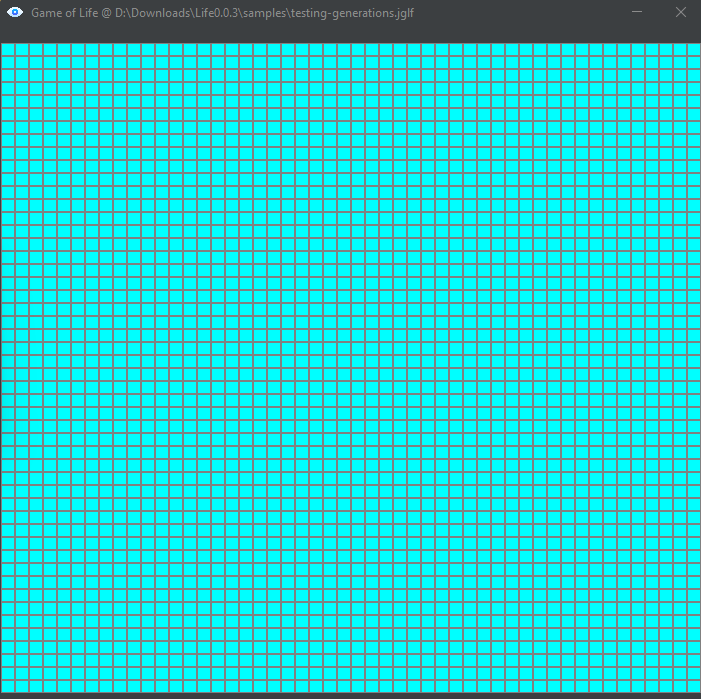
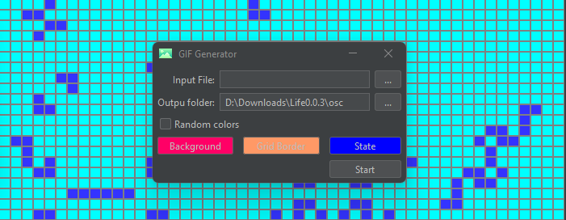

# Java Game Of Life

The Game of Life is a cellular automaton designed by the British mathematician John Horton Conway in 1970. It is a zero-player game, which means that its evolution is determined by the initial state and does not require any further input of data.

## Contents

- [Java Game Of Life](#java-game-of-life)
  - [Contents](#contents)
  - [Rules](#rules)
  - [GUI](#gui)
    - [Controls](#controls)
    - [Saving and Loading patterns](#saving-and-loading-patterns)
    - [Grid](#grid)
    - [Animations](#animations)
  - [Examples](#examples)

## Rules

The "game board" is a flat, toroidal grid made up of squares (the "cells") that extends infinitely in all directions. Therefore, each cell has 8 "neighbors", which are the ones that are closest to it, including diagonals. The cells have two states: they are either "alive" or "dead" (or "on" and "off"). The state of the cells evolves over discrete units of time (you could say by turns). The state of all cells is taken into account to calculate their state in the next turn. All cells are updated simultaneously in each turn, following these rules:

1. A dead cell with exactly 3 live neighboring cells "comes to life" (i.e., in the next turn it will be alive).
2. A live cell with 2 or 3 live neighboring cells remains alive, otherwise it dies (due to "loneliness" or "overcrowding").

Extracted from [Wikipedia](https://en.wikipedia.org/wiki/Conway%27s_Game_of_Life)

## GUI

### Controls

The control window will allow you to start the computation of the game's states. Use the Play button to start the game (you can stop it with the Stop button). Additionally, we will observe the population of each state and its respective generation.

  

### Saving and Loading patterns

An important feature of the GUI is that we can save and load patterns. To save a pattern, simply draw one beforehand on the grid by clicking on the desired locations. Then, in the control window, the "Save" button will create a **jglf** format file with a list of coordinates where the cells are alive.

  

Once we have our own patterns, we can load them using the "Open" button. Then, it will automatically clear the grid and load the entire cells.

  

### Grid

On the grid, we will visualize the change of states and (when the game is paused) we can draw custom patterns. The game is programmed toroidally (similar to the surface of a planet represented on a plane). Therefore, the grid is **NOT** infinite.

  

### Animations

You can generate animations through the button specified in the GUI. Then, you will need to provide an output path for the generated images and the colors to use. Additionally, it is possible to take any file and convert it to a starting pattern for the game based on the bytes of the file. This is useful for generating various patterns without "drawing" them on the grid, especially for quick testing purposes.

  

## Examples

You can download some patterns as [examples](https://github.com/crixodia/java-game-of-life/blob/master/examples/). One of the most intriguing ones are the oscillators ([osc.jglf](https://github.com/crixodia/java-game-of-life/blob/master/examples/osc.jglf)).

  

When generating a gif animation, you will get something similar to the following image. You can define the possibility of an infinite loop for the gif.

  

🧐 For suggestions or questions, you can contact [@crixodia](https://www.twitter.com/crixodia)
